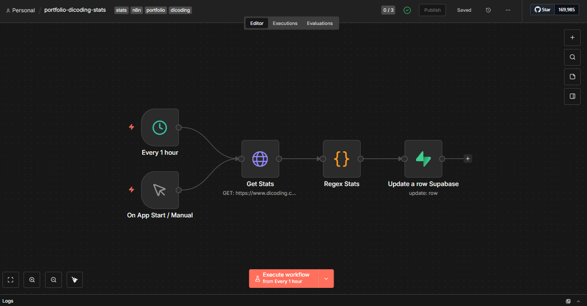

# 🤖 Dicoding Stats Automation with n8n & Supabase


[](https://opensource.org/licenses/MIT)
[](https://ridwansuryantara.netlify.app)

**Automated tracking of Dicoding learning progress (XP) using n8n Web Scraping with data stored in Supabase.**

## 📖 Overview

This repository hosts an n8n workflow designed to track your learning journey on Dicoding (Indonesia's leading tech academy). Since Dicoding does not provide a public API, this workflow works by fetching your public profile page and using **Regex (Regular Expressions)** to extract your total XP, storing the history in Supabase.

## 📸 Workflow Preview



## ✨ Features

* **Automated Scheduling:** Runs automatically every 1 hour or on app start.
* **Web Scraping Integration:** Fetches the raw HTML of your public Dicoding profile.
* **Smart Parsing:** Uses JavaScript & Regex to locate and extract specific data points from the website code:
    * ⚡ **Total XP:** Tracks your accumulated experience points.
* **Data Storage:** Processes and updates the corresponding row in **Supabase**.

## 🛠️ Tech Stack

* **Automation:** [n8n](https://n8n.io/) (Self-hosted/Cloud)
* **Database:** [Supabase](https://supabase.com/) (PostgreSQL)
* **Method:** HTML Scraping & Regex Parsing

## 🚀 How to Use

### 1. Import Workflow
* Download the `.json` file from this repository.
* Open your n8n editor.
* Click the menu (top right) and select `Import from File`.

### 2. Configure Nodes

Follow the steps below to configure each node with your own Dicoding Profile and Database credentials.

#### ⏰ Schedule (Every 1 Hour)
* Set the **Trigger Interval** (e.g., Every 1 Hour) based on how often you want to track data.

#### 🌐 Get Stats (Fetch HTML)
* **Method:** `GET`
* **URL:** Replace `YOUR_USERNAME` with your actual Dicoding username.
    ```text
    [https://www.dicoding.com/users/YOUR_USERNAME/](https://www.dicoding.com/users/YOUR_USERNAME/)
    ```
    *Example:* `https://www.dicoding.com/users/riyogs/`
* **Headers:**
    * **Crucial:** You must add a `User-Agent` header to mimic a real browser to ensure the page loads correctly.
    * `Name`: `User-Agent`
    * `Value`: `Mozilla/5.0 (Windows NT 10.0; Win64; x64) AppleWebKit/537.36 (KHTML, like Gecko)`

#### 📝 Regex Stats (Parse Data)
* This node contains JavaScript code to find the XP value inside the HTML code.
* It looks for the pattern: `/([\d.]+)\s*<span[^>]*title="XP"/`.
* *Note:* If Dicoding changes their website layout/class names in the future, this regex might need to be updated.

#### 💾 Update a row Supabase
* **Operation:** `Update`
* **Table:** `platform_stats` (or your specific table name).
* **Authentication:**
    * Select **Predefined Credential Type** -> **Supabase API**.
    * Select your credentials.
* **Update Condition:**
    * The workflow is set to update a row where `platform` equals `'dicoding'`.
    * *Important:* Ensure you have a row in your database with the column `platform` set to `dicoding` before running this, or switch the operation to "Upsert".

### 3. Activate
* Toggle the workflow to **Active** in the top right corner.

## 📝 Data Structure

The workflow extracts the XP and sends a JSON object similar to this to Supabase:

```json
{
  "xp": 15000,
  "platform": "dicoding"
}
